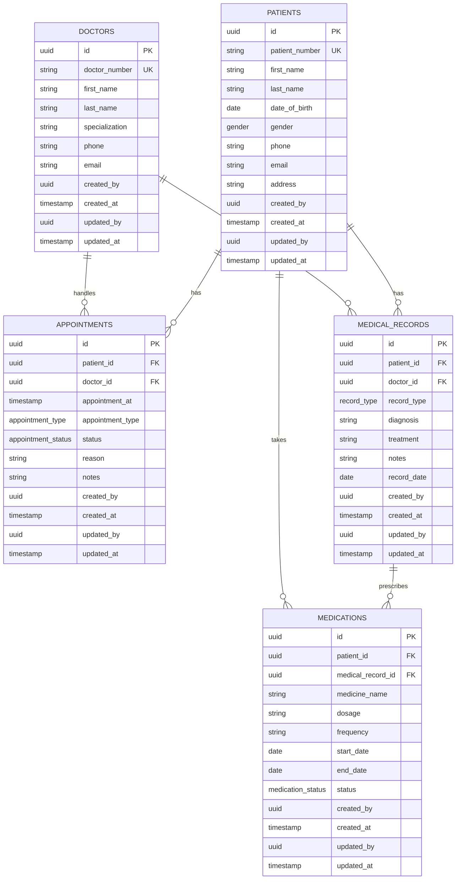

# Healthcare API — Entity-Relationship Diagram

## 4.1 Patients, doctors, appointments, medical records and medications

```mermaid
erDiagram

    PATIENTS {
        uuid id PK
        string patient_number UK
        string first_name
        string last_name
        date date_of_birth
        gender gender
        string phone
        string email
        string address
        uuid created_by
        timestamp created_at
        uuid updated_by
        timestamp updated_at
    }

    DOCTORS {
        uuid id PK
        string doctor_number UK
        string first_name
        string last_name
        string specialization
        string phone
        string email
        uuid created_by
        timestamp created_at
        uuid updated_by
        timestamp updated_at
    }

    APPOINTMENTS {
        uuid id PK
        uuid patient_id FK
        uuid doctor_id FK
        timestamp appointment_at
        appointment_type appointment_type
        appointment_status status
        string reason
        string notes
        uuid created_by
        timestamp created_at
        uuid updated_by
        timestamp updated_at
    }

    MEDICAL_RECORDS {
        uuid id PK
        uuid patient_id FK
        uuid doctor_id FK
        record_type record_type
        string diagnosis
        string treatment
        string notes
        date record_date
        uuid created_by
        timestamp created_at
        uuid updated_by
        timestamp updated_at
    }

    MEDICATIONS {
        uuid id PK
        uuid patient_id FK
        uuid medical_record_id FK
        string medicine_name
        string dosage
        string frequency
        date start_date
        date end_date
        medication_status status
        uuid created_by
        timestamp created_at
        uuid updated_by
        timestamp updated_at
    }

    PATIENTS ||--o{ APPOINTMENTS : "has"

    DOCTORS ||--o{ APPOINTMENTS : "handles"

    PATIENTS ||--o{ MEDICAL_RECORDS : "has"

    DOCTORS ||--o{ MEDICAL_RECORDS : "creates"

    MEDICAL_RECORDS ||--o{ MEDICATIONS : "prescribes"

    PATIENTS ||--o{ MEDICATIONS : "takes"
```
