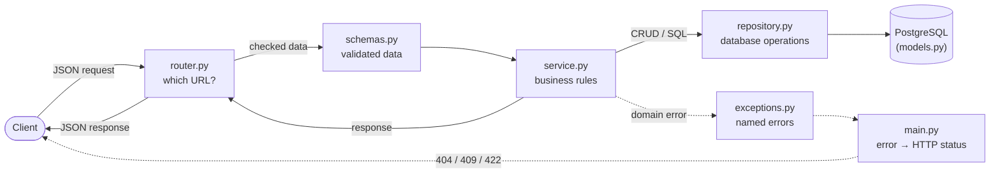
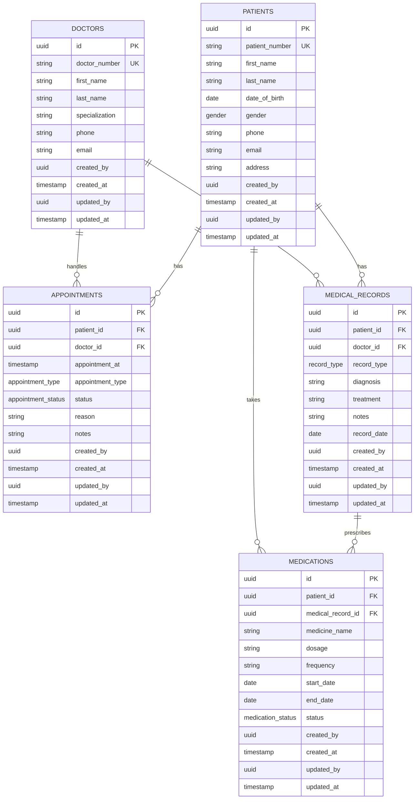

# From ER diagram to working API

This guide describes a simple Healthcare API built in the same style as the rentals-api example: database tables, Python code, HTTP endpoints, validation, business rules, migrations, errors, and tests.

---

## 1. What we built, in one minute

- **5 tables** from the ER diagram: `patients`, `doctors`, `appointments`, `medical_records` and `medications`.
- **5 feature folders** in `src/healthcare_api/`: `patients/`, `doctors/`, `appointments/`, `medical_records/` and `medications/`.
- **1 migration** that creates the healthcare tables in PostgreSQL.
- **An API** under `/api/v1` to create, read, update, delete and search.
- **Tests** for the endpoints, run against a real database.

---

## 2. Where the code lives

```text
src/healthcare_api/

    patients/          # patients table
    doctors/           # doctors table
    appointments/      # appointments table
    medical_records/   # medical records table
    medications/       # medications table

    db/
        mixins.py      # shared audit columns
        base.py        # SQLAlchemy model registry

    api/
        deps.py        # database session, actor ID and pagination
        router.py       # mounts feature routers

    main.py             # FastAPI application and error mapping

alembic/versions/
    ..._add_healthcare_schema.py

tests/
    patients/
    doctors/
    appointments/
    medical_records/
    medications/
```

Every feature folder follows the same five-file pattern:

| File | Its one job |
| --- | --- |
| `models.py` | Shape of the database table: columns, types and keys |
| `schemas.py` | Shape of JSON accepted and returned by the API |
| `service.py` | Business rules, validation and database operations |
| `router.py` | URLs and HTTP methods |
| `exceptions.py` | Named domain errors |

The important idea is the same as the rentals-api design: a folder represents a **feature**, not simply a database table.

---

## 3. The journey of one request



For example, `POST /api/v1/patients` follows this flow:

1. **FastAPI validates the JSON** against `PatientCreate` in `schemas.py`.
2. **The router** passes the validated request to the service.
3. **The service** applies business rules and creates the patient.
4. **The repository** performs the database operation.
5. **PostgreSQL** stores the record.
6. The service returns the result and the router sends the JSON response.
7. Domain errors are converted to HTTP status codes in one place.

The service does not need to know about HTTP status codes. This keeps business logic independently testable.

---

## 4. The database tables

### 4.1 Patients, doctors, appointments, medical records and medications



### 4.2 Four columns every table shares

Every table has:

- `created_by`
- `created_at`
- `updated_by`
- `updated_at`

These can be implemented once using an `AuditMixin` and inherited by each SQLAlchemy model.

| Column | Filled by |
| --- | --- |
| `created_at` / `updated_at` | Database/application timestamp |
| `created_by` / `updated_by` | ID of the actor making the request |

For a simple development implementation, the actor ID can initially come from an `X-User-Id` header. In production, this should be replaced by an authenticated identity from OAuth2/OIDC or the organization's identity provider.

---

## 5. Fixed lists of choices

Healthcare records contain fields that should only accept known values.

| Column | Example allowed values |
| --- | --- |
| `gender` | `male`, `female`, `other`, `unknown` |
| `appointment_type` | `consultation`, `follow_up`, `emergency`, `telemedicine` |
| `appointment_status` | `scheduled`, `completed`, `cancelled`, `no_show` |
| `record_type` | `diagnosis`, `lab_result`, `procedure`, `clinical_note` |
| `medication_status` | `active`, `completed`, `discontinued` |

These can be represented as Python enums and PostgreSQL enum types where appropriate.

---

## 6. Relationships and delete rules

The relationships should protect the integrity of healthcare data.

| You delete... | What happens |
| --- | --- |
| A patient with appointments | Refused while dependent records exist |
| A patient with medical records | Refused while dependent records exist |
| A doctor with appointments | Refused while dependent records exist |
| A medical record with medications | Medication records can be removed with the parent record if they have no independent lifecycle |
| A medication | Only that medication is removed |

For healthcare data, avoid casually using cascading deletes on important clinical records. In a real system, clinical records are generally retained according to the organization's retention and regulatory requirements.

---

## 7. Database safety rules

Useful database-level constraints include:

- `patient_number` must be unique.
- `doctor_number` must be unique.
- `date_of_birth` cannot be in the future.
- Appointment references must point to an existing patient and doctor.
- Medical record references must point to an existing patient and doctor.
- Medication references must point to an existing patient and medical record.
- Required fields should be `NOT NULL`.
- Foreign-key columns should be indexed.
- Appointment queries should have indexes on `patient_id`, `doctor_id` and `appointment_at`.
- Medical-record queries should have indexes on `patient_id` and `record_date`.

---

## 8. The migration

A migration creates the healthcare schema in PostgreSQL.

```text
uv run poe migrate

uv run poe revision -m "add healthcare schema"

uv run poe fmt
```

The migration should create:

```text
patients
doctors
appointments
medical_records
medications
```

It should also create the required foreign keys, unique constraints, indexes and enum types.

To verify that the SQLAlchemy models and database agree:

```text
uv run poe revision -m "recheck"
```

If there are no model changes, no unexpected migration should be generated.

---

## 9. Using the API

Everything is under `/api/v1`.

### 9.1 Patient endpoints

| Method | Path | What it does |
| --- | --- | --- |
| `GET` `POST` | `/patients` | List / create patients |
| `GET` `PATCH` `DELETE` | `/patients/{id}` | Read / change / delete one patient |

### 9.2 Doctor endpoints

| Method | Path | What it does |
| --- | --- | --- |
| `GET` `POST` | `/doctors` | List / create doctors |
| `GET` `PATCH` `DELETE` | `/doctors/{id}` | Read / change / delete one doctor |

### 9.3 Appointment endpoints

| Method | Path | What it does |
| --- | --- | --- |
| `GET` `POST` | `/appointments` | List / create appointments |
| `GET` `PATCH` `DELETE` | `/appointments/{id}` | Read / change / delete one appointment |

### 9.4 Medical record endpoints

| Method | Path | What it does |
| --- | --- | --- |
| `GET` `POST` | `/medical-records` | List / create medical records |
| `GET` `PATCH` `DELETE` | `/medical-records/{id}` | Read / change / delete one |
| `GET` | `/patients/{id}/medical-records` | List records for a patient |

### 9.5 Medication endpoints

| Method | Path | What it does |
| --- | --- | --- |
| `GET` `POST` | `/medications` | List / create medications |
| `GET` `PATCH` `DELETE` | `/medications/{id}` | Read / change / delete one |
| `GET` | `/patients/{id}/medications` | List medications for a patient |

Lists should support pagination using `limit` and `offset`.

---

## 10. Example: Create a patient

```http
POST /api/v1/patients

X-User-Id: 3f2a9c1e-5b7d-4e8a-9c6f-1a2b3c4d5e6f

{
    "patient_number": "PAT-10001",
    "first_name": "John",
    "last_name": "Smith",
    "date_of_birth": "1985-05-12",
    "gender": "male",
    "phone": "+91-9876543210",
    "email": "john@example.com",
    "address": "Hyderabad, Telangana"
}
```

Response:

```json
{
    "id": "d888e43a-...",
    "patient_number": "PAT-10001",
    "first_name": "John",
    "last_name": "Smith",
    "date_of_birth": "1985-05-12",
    "gender": "male",
    "phone": "+91-9876543210",
    "email": "john@example.com",
    "address": "Hyderabad, Telangana",
    "created_by": "3f2a9c1e-...",
    "created_at": "2026-09-12T05:47:03Z",
    "updated_by": "3f2a9c1e-...",
    "updated_at": "2026-09-12T05:47:03Z"
}
```

---

## 11. Example: Create an appointment

```http
POST /api/v1/appointments

{
    "patient_id": "d888e43a-...",
    "doctor_id": "a1234567-...",
    "appointment_at": "2026-09-15T10:30:00Z",
    "appointment_type": "consultation",
    "status": "scheduled",
    "reason": "Routine consultation",
    "notes": "Patient requested morning appointment"
}
```

The service should verify that:

1. The patient exists.
2. The doctor exists.
3. The appointment type is valid.
4. The appointment status is valid.
5. The requested time is valid.
6. The doctor is not already booked for the same slot, if the business rule requires this.

---

## 12. Example: Add a medical record

```http
POST /api/v1/medical-records

{
    "patient_id": "d888e43a-...",
    "doctor_id": "a1234567-...",
    "record_type": "diagnosis",
    "diagnosis": "Hypertension",
    "treatment": "Lifestyle modification and follow-up",
    "notes": "Follow-up required after four weeks",
    "record_date": "2026-09-12"
}
```

A medical record belongs to a patient and is associated with the doctor who created it.

---

## 13. Example: Add medication

```http
POST /api/v1/medications

{
    "patient_id": "d888e43a-...",
    "medical_record_id": "b7654321-...",
    "medicine_name": "Example Medicine",
    "dosage": "10 mg",
    "frequency": "Once daily",
    "start_date": "2026-09-12",
    "end_date": "2026-10-12",
    "status": "active"
}
```

The service verifies that the referenced patient and medical record exist before creating the medication.

---

## 14. Searching patients

```http
GET /api/v1/patients?name=john&limit=20&offset=0
```

Possible filters:

| Filter | Example | Meaning |
| --- | --- | --- |
| `name` | `name=john` | Search patient name |
| `patient_number` | `patient_number=PAT-10001` | Exact patient |
| `gender` | `gender=male` | Filter by gender |
| `limit` | `limit=20` | Page size |
| `offset` | `offset=40` | Number of records to skip |

---

## 15. Searching appointments

```http
GET /api/v1/appointments?doctor_id=a1234567-...&status=scheduled
```

Useful filters:

| Filter | Example | Meaning |
| --- | --- | --- |
| `patient_id` | `patient_id=...` | Appointments for one patient |
| `doctor_id` | `doctor_id=...` | Appointments for one doctor |
| `status` | `status=scheduled` | Appointment status |
| `appointment_type` | `appointment_type=consultation` | Appointment type |
| `from_date` | `from_date=2026-09-01` | Starting date |
| `to_date` | `to_date=2026-09-30` | Ending date |
| `limit`, `offset` | `limit=20&offset=0` | Pagination |

Filters combine so every supplied filter must match.

---

## 16. When things go wrong

| Status | When | Example |
| --- | --- | --- |
| **404** Not Found | Patient/doctor/appointment/record/medication doesn't exist | `Patient ... not found` |
| **409** Conflict | Duplicate patient or doctor number | `Patient number already exists` |
| **409** Conflict | Doctor already booked for the requested slot | `Doctor is already booked` |
| **422** Unprocessable | Invalid request or referenced entity | `Doctor ... does not exist` |
| **422** Unprocessable | Invalid enum or field value | Invalid appointment status |

Keep domain exceptions separate from HTTP handling:

```python
class PatientNotFoundError(Exception):
    pass


class DuplicatePatientNumberError(Exception):
    pass
```

Then map them centrally in `main.py`:

```python
DOMAIN_ERROR_STATUS = {
    PatientNotFoundError: 404,
    DuplicatePatientNumberError: 409,
}
```

This follows the same separation used in the rentals-api example: services raise named domain errors and the application layer maps them to HTTP status codes.

---

## 17. PATCH behavior

`PATCH` changes only the fields supplied by the client.

For example:

```http
PATCH /api/v1/patients/d888e43a-...

{
    "phone": "+91-9999999999",
    "email": "new@example.com"
}
```

The patient's name, date of birth and other fields remain unchanged.

The audit information changes accordingly:

```json
{
    "created_by": "original-user",
    "updated_by": "current-user"
}
```

---

## 18. Testing

```text
docker compose up -d db

uv run poe test
```

Tests should cover:

- Patient CRUD
- Doctor CRUD
- Appointment CRUD
- Medical-record CRUD
- Medication CRUD
- Patient search
- Appointment filtering
- Pagination
- Duplicate identifiers
- Missing referenced records
- Invalid enum values
- Appointment conflicts
- Audit fields
- Foreign-key behavior
- Migration consistency

Each test should run in an isolated transaction so test data does not leak between tests.

---

## 19. Production considerations

For a real healthcare system, the simple development API should be extended with:

- OAuth2/OIDC authentication
- RBAC/ABAC authorization
- Patient consent checks
- Encryption in transit and at rest
- Audit logging for access to patient data
- Secrets stored in a secrets manager
- Database backup and recovery
- Data retention policies
- Rate limiting
- Structured application logging
- Metrics and health checks
- FHIR integration where interoperability is required

The important architectural boundary remains:

```text
Router
   ↓
Pydantic Schema
   ↓
Service
   ↓
Repository
   ↓
PostgreSQL
```

Keep the initial implementation simple and add healthcare-specific security and compliance controls as separate concerns.
